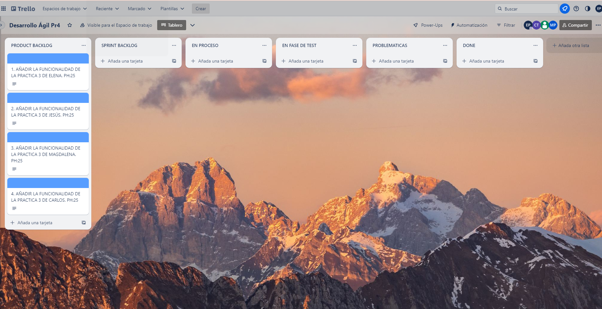
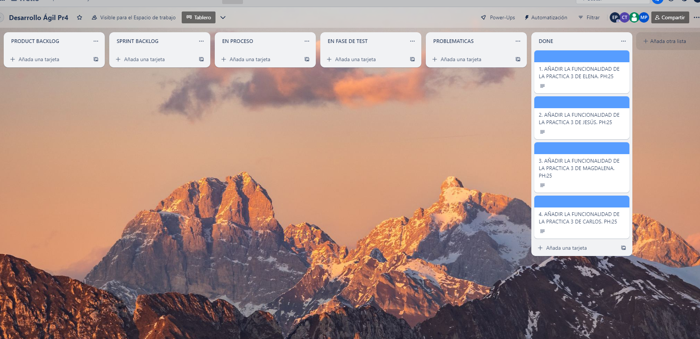
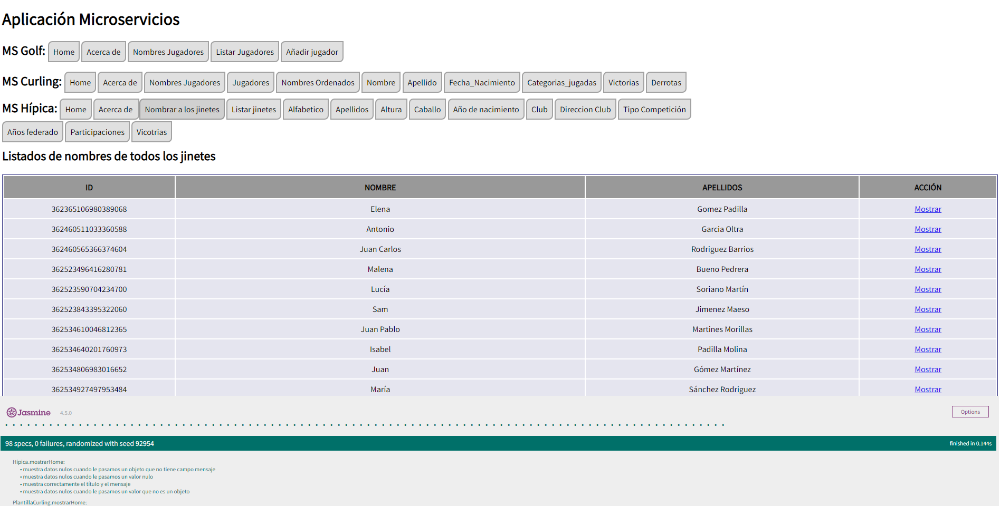
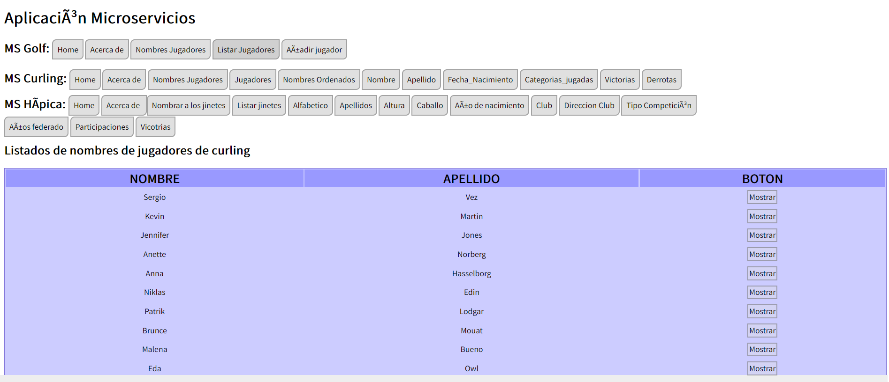

[](https://classroom.github.com/a/hCaQWL7N)
[](https://classroom.github.com/online_ide?assignment_repo_id=10906677&assignment_repo_type=AssignmentRepo)


## RESOLUCIÓN DE LA PRÁCTICA

### *INFORMACIÓN SOBRE LOS AUTORES*
### -----------------------------------------------------
* *NOMBRE*: Elena
* *APELLIDOS*: Gómez Padilla
* *EMAIL*: egp00044@red.ujaen.es
* 
*  
* *NOMBRE* : Magdalena
* *APELLIDOS*: Bueno Pedrera
* *EMAIL*: mmbp0003@gmail.com

### -----------------------------------------------------
###  *TABLERO DE TRELLO*
* [Enlace al tablero de Trello](https://trello.com/b/c2oGGDcT/desarrollo-%C3%A1gil-pr4) ↗️

TABLERO DE TRELLO EL COMIENZO DE LA ITERACIÓN 1



TABLERO DE TRELLO EL FINAL DE LA ITERACIÓN 1

### -----------------------------------------------------

###  FUNCIONAMIENTO DE LA APLICACIÓN

###  *ITERACIÓN 1*

En esta primera iteración se han unido los 4 proyectos (práctica 3) 
de los estudiantes que conforman el grupo de trabajo. Para ello los primero
que hemos hecho ha sido crear una rama para cada integrante, en la cual ha subido
su anterior proyecto y preparado para la unión. Una vez cualquier fallo ha sido
solucionado, coenzamos a trabajar en la rama Main de GitHub, en la cual uno por uno
cada desarrollador ha integrado su código con los anteriores.
Estas han sido las funcioes modificadas: 

### Proyecto Hípica
Los archivos modificados para la integración han sido: 
```
· ms-hipica
· front-end/static-files/js/ms-hipica.js
· front-end/static-files/js/ms-hipica-spec.js
· ms-hipica/server.js
· api-gateway/proxy-routes.js
· front-end/static-files/index.html
```
Primero modificamos con el nombre la carpeta *ms-plantilla* a *ms-hipica*, lo cual no 
supuso un gran cambio.
A continuación alteramos el nombre del fichero *ms-plantilla.js a *ms-hipica.js*
Lo cual supuso modificar todo lo relativo al nombre de la clase en todos los 
archivos donde fuera relevante, al igual que con *ms-plantilla-spec.js*

Todos los compañeros compartimos el archicho *ms-plantilla.css*, por lo que 
cambié el nombre de *listado-jinetes* a *listado-personas* en la clase *ms-hipica.js*.


En el fichero *ms-hipica/server.js* alteré el puerto 8002 por 8004 de modo
que no interfiere con a  ruta de lor proyectos de mis compañeros.
```
    const port = 8004;
```
Para que la nueva ruta fuera accesible para el api-gateway compartido entre
mis copeñros y yo añadí el siguiente código enlazandolo con mis proyecto Hípica 
en el fichero *api-gateway/proxy-routes.js*
```
    {
        url: '/hipica',
        proxy: {
            target: "http://localhost:8004",
            changeOrigin: true,
            pathRewrite: {
                [`^/hipica`]: '',
            },
        }
    }   
 ```

Por último, para que el usuario tuviera acceso a el contenido de la aplicación
añadí todas las funcionalidades al archivo *index.html*, y los import que permitían
el acceso al código y los test: 
 ```
    <script src="js/ms-hipica.js"></script>
```
```
    <script src="js/ms-hipica-spec.js"></script>
```

###  *HISTORIA DE USUARIO 1*


### PROYECTO CURLING

Ahora vamos a hablar sobre las modificaciones que hemos hecho dentro de Curling para poder unirlo al resto de proyectos
y trabajos de nuestros compañeros de equipo. Para ellos tuvimos que modificar una serie de clases y carpetas para que todas
ellas no tuviesen el mismo nombre, y son:

```
 -  ms-Curling -----> carpeta
 -  front-end/static-files/js/ms-Curling.js
 -  front-end/static-files/js/ms-Curling-spec.js
 -  ms-Curling/server.js
 -  api-gateway/proxy-routes.js
 -  front-end/static-files/index.html
```

Debemos cambiar la carpeta para que los nombres de cada una de las carpetas ms no se fueran pisando; por lo tanto, cada proyecto 
pondrá el nombre que es su deporte. Luego de eso, dentro de la clase ms-Curling.js y ms-Curling-spec-js hemos cambiado el 
nombre de la plantilla dentro de ella; en mi caso, pasa de Plantilla a PlantillaCurling, en las dos clases por igual,

En ms-Curling/server.js hemos indicado cual es el nuevo puerto en el que va a trabajar nuestro trabajo en este caso hemos 
intercambiado el 8002 por el 8003 en mi caso. En proxy-ruter he añadido la ruta de mi trabajo para que se pueda conectar 
con la clase de front-end, y hemos añadido el siguiente segmente dentro de (const ROUTES):

```
   {
        url: '/plantillaCurling',
        proxy: {
            target: "http://localhost:8003",
            changeOrigin: true,
            pathRewrite: {
                [`^/plantillaCurling`]: '',
            },
        }
    },
```

Por último en el index hemos añadido nuestro botones que se veran en el html de la página que conectan direcamtne con las 
clases de ms-Curling.js y ms-Curling-spec.js

###  *HISTORIA DE USUARIO 3*
